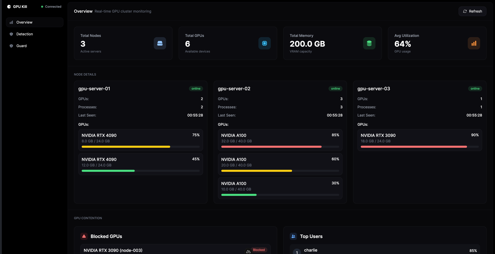

# GPU Kill

A CLI tool for managing GPUs across NVIDIA, AMD, Intel, and Apple Silicon systems. Monitor, control, and secure your GPU infrastructure with ease.

## Community & Support

Join our Discord community for discussions, support, and updates:

[](https://discord.gg/KqdBcqRk5E)


## Features

- **Monitor GPUs**: Real-time usage, memory, temperature, and processes
- **Kill Processes**: Gracefully terminate stuck GPU processes
- **Security**: Detect crypto miners and suspicious activity
- **Guard Mode**: Policy enforcement to prevent resource abuse
- **Dashboard**: Web interface for cluster monitoring
- **Remote**: Manage GPUs across multiple servers
- **Multi-Vendor**: Works with NVIDIA, AMD, Intel, and Apple Silicon

## Requirements

- **NVIDIA**: NVIDIA drivers installed
- **AMD**: ROCm drivers installed  
- **Intel**: intel-gpu-tools package installed
- **Apple Silicon**: macOS with Apple Silicon (M1/M2/M3/M4)
- **OS**: Linux, macOS, or Windows
- **Rust**: 1.70+ (for building from source)

## Quick Start

### Install & Run
```bash
# Build from source
git clone https://github.com/kagehq/gpu-kill.git
cd gpu-kill
cargo build --release

# Or install via Cargo
cargo install gpukill

# List your GPUs
gpukill --list

# Watch GPU usage in real-time
gpukill --list --watch
```

### Common Tasks
```bash
# Kill a stuck process
gpukill --kill --pid 12345 --force

# Reset a crashed GPU
gpukill --reset --gpu 0 --force

# Start the web dashboard (backend only)
gpukill --server --server-port 8080
```

## Dashboard

Start the web interface for cluster monitoring:

```bash
# 1. Start the backend API server
gpukill --server --server-port 8080

# 2. Start the dashboard UI (in a new terminal)
cd dashboard
npm install  # First time only
npm run dev

# 3. Access the dashboard
open http://localhost:3000
```

**Note**: You need both the backend server (port 8080) and frontend UI (port 3000) running for the dashboard to work.



The dashboard provides:
- **Real-time monitoring** of all GPUs
- **Security detection** with threat analysis
- **Policy management** for resource control
- **Cluster overview** with Magic Moment insights

## Security & Policies

### Detect Threats
```bash
# Scan for crypto miners and suspicious activity
gpukill --audit --rogue

# Configure detection rules
gpukill --audit --rogue-config
```

### Policy Enforcement
```bash
# Enable Guard Mode
gpukill --guard --guard-enable

# Test policies safely
gpukill --guard --guard-test-policies
```

*For detailed security and policy documentation, see [DETAILED.md](DETAILED.md).*

## Remote Management

Manage GPUs across multiple servers via SSH:

```bash
# List GPUs on remote server
gpukill --remote staging-server --list

# Kill process on remote server
gpukill --remote prod-gpu-01 --kill --pid 1234

# Reset GPU on remote server
gpukill --remote gpu-cluster --reset --gpu 0
```

## Need Help?

```bash
gpukill --help                    # Show all options
gpukill --version                 # Show version
```

## Documentation

- **[DETAILED.md](DETAILED.md)** - Complete documentation, API reference, and advanced features
- **[Dashboard README](dashboard/README.md)** - Web interface documentation

## License

This project is licensed under the FSL-1.1-MIT License. See the LICENSE file for details.